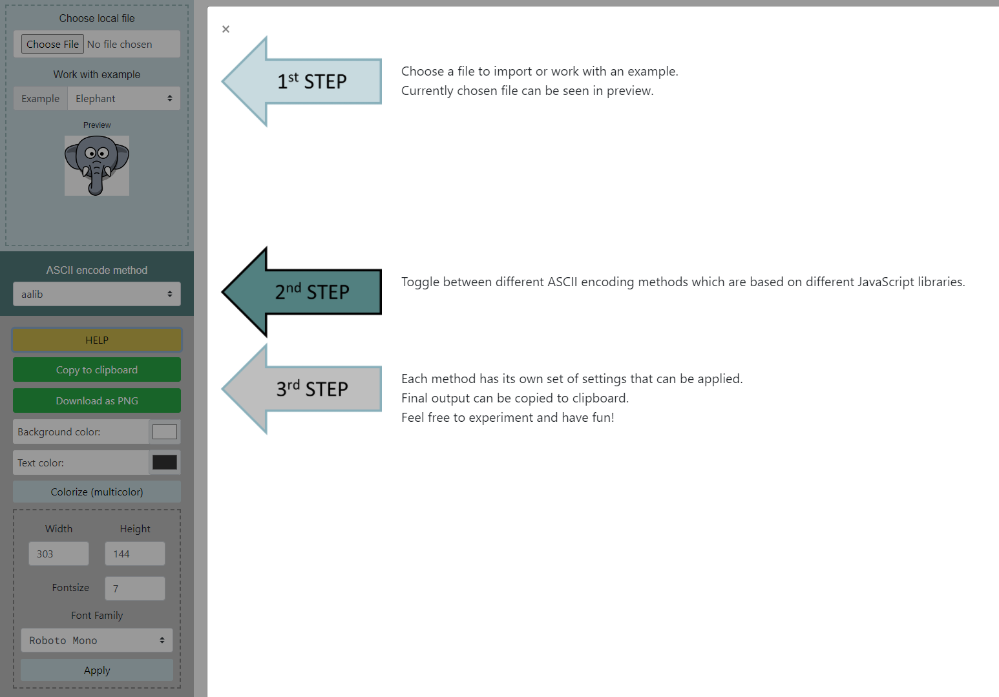
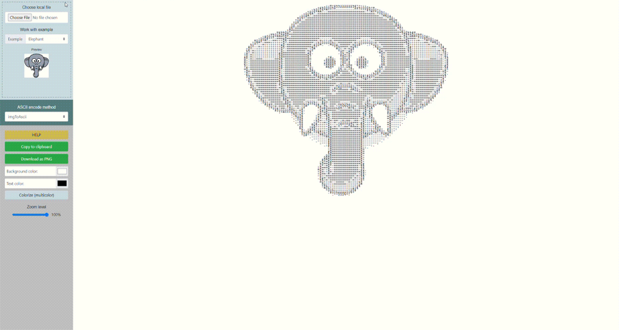
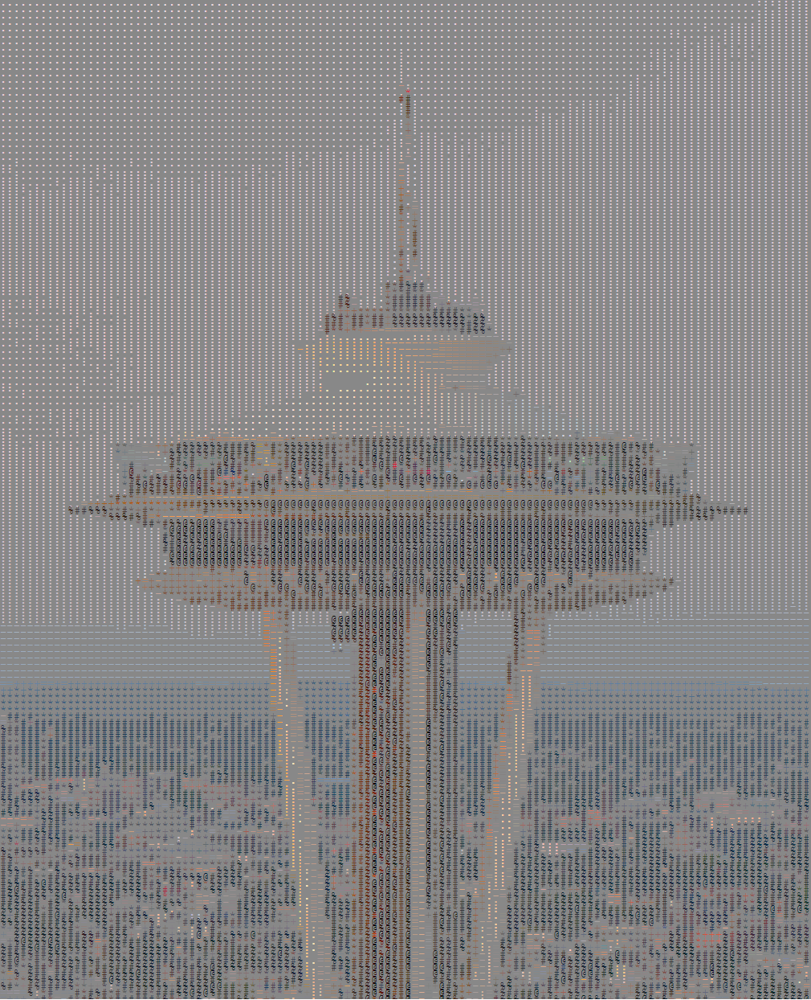
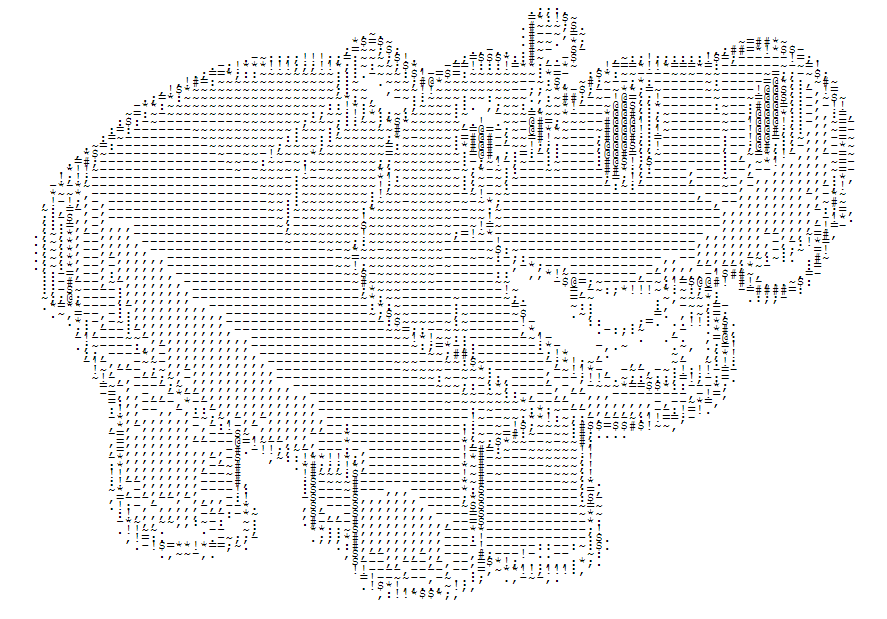
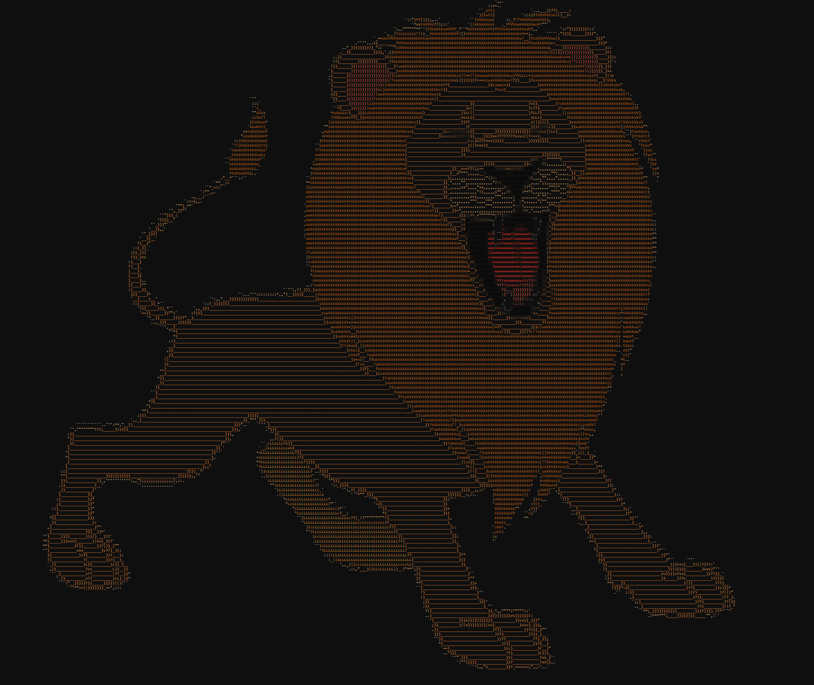

# ASCII art generator

This tool combines 3 ASCII generating libraries and allows user to apply settings.

## [Online tool link](https://oltis17.github.io/ascii/index.html)

## Steps while using the tool
1. Input

    Input is accepted from local image files. Or user can choose to work with examples.

2. ASCII encoding method selection

    One of 3 supported libraries can be chosen. Different setting may be avilable for diffeent libraries.

3. Settings

- colors of text and background can be changed

- original image colors can be rocognized and applied to individual ASCII characters

- size can be changed (either by zoom slider or by selecting height and width values)

- fontsize and font family can be changed (if choosing aalib encoding method)

4. Getting the output

    Final output can be copied to clipboard or saved as a PNG picture.

User can get more information when clicking the HELP button.

## Usage example

## Output examples

Method: imgToAscii

Multicolor

Zoom: 20%

Example: hippo

Method: jscii

Single color

Default Settings

Example: lion

Method: aalib

Multicolor

Darker background

Method: aalib

Multicolor

Gray background